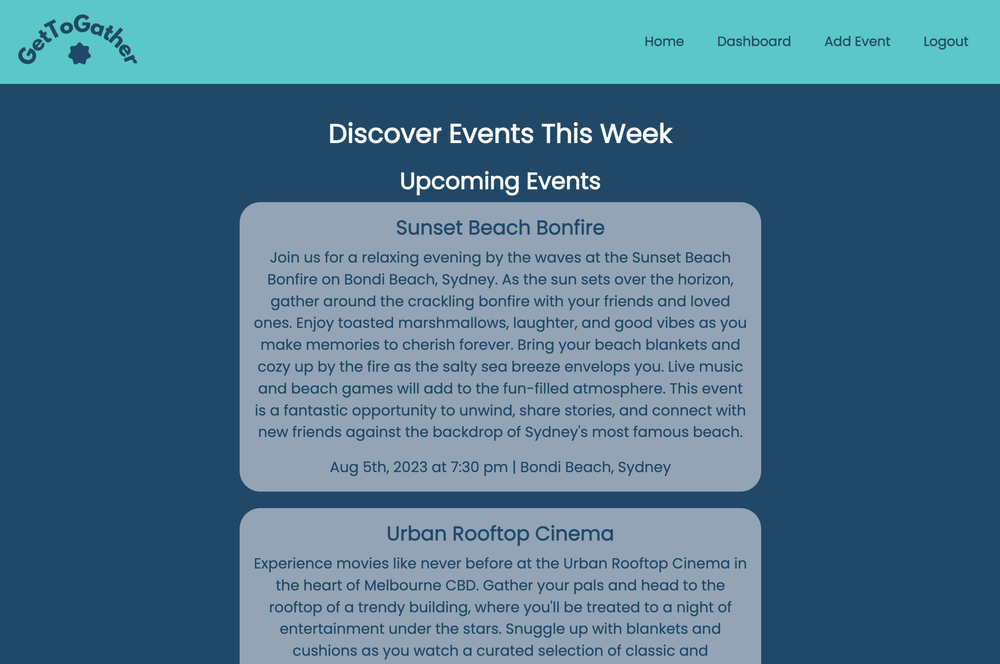
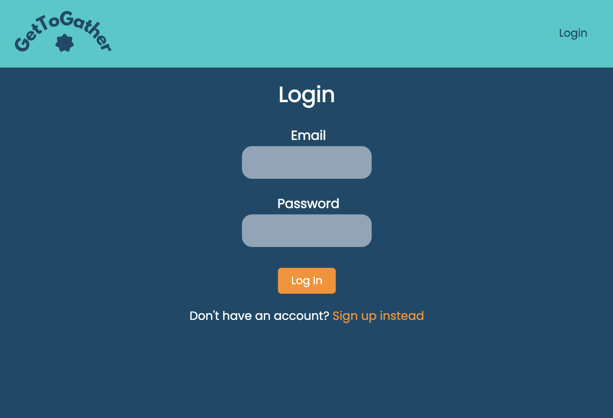
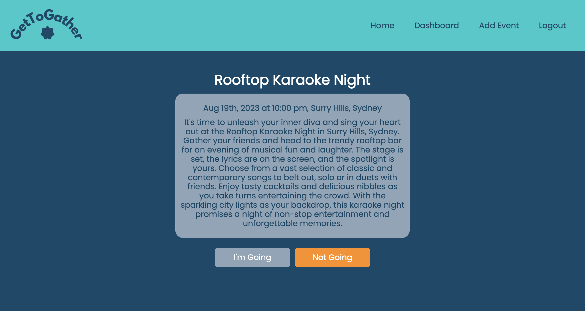
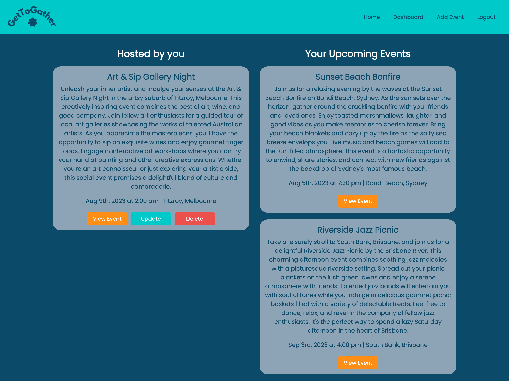

# GetToGather: Interactive Full-Stack Application

## Description

GetToGather is an engaging MERN stack single-page application that revolutionizes event planning and participation. Whether it's a social gathering, a charity event, or a professional conference, GetToGather empowers users to create, manage, and attend events seamlessly. With its polished user interface and intuitive features, GetToGather offers a unique and novel experience for event enthusiasts.

Key Features:

- User Registration and Authentication: Sign up and log in securely using email and password or through social media authentication. Authenticated users gain access to event creation and management capabilities.
- Event Creation and Management: Organize events effortlessly by providing event details such as name, date, time, location, and a captivating description.
- RSVP Functionality: Attendees can easily RSVP to events they wish to participate in, enhancing event coordination and planning.
- Interactive Event Pages: Each event page displays comprehensive information, including event date, time, location, and RSVP functionality.
- User Profile and Event Dashboard: Users can view their upcoming events and events they have organized, fostering a sense of community involvement.
- Responsive Design: Enjoy a seamless user experience on any device, from desktop to mobile, ensuring convenience and accessibility.

GetToGather aims to bring people together through shared experiences and interests. With its scalable, user-focused approach, the application provides a clean and polished UI that showcases upcoming events and empowers users to connect with their communities. Whether you're a seasoned event planner or a casual attendee, GetToGather is your go-to platform for creating, discovering, and celebrating memorable events.- 

## Technologies Used

- React
- CSS
- Node.js
- Express.js
- GraphQL
- MongoDB
- Mongoose
- JSON Web Tokens (JWT)

## Installation & Links

1. Clone the repository.
2. Install server and client dependencies using `npm install` and `cd client && npm install`.
3. Seed the database by running `npm run seed`.
5. Start the application using `npm run develop`.

- [Link to the GitHub repository](https://github.com/isabelkvaughan/GetToGather)
- [Link to the deployed application](https://github.com/isabelkvaughan/GetToGather)

## Mock Up

- GetToGather Home Page
  
- Login
  
- Event Page
  
- User Dashboard
  

## Contributors

- Sadima Maharjan - [github.com/SadimaMaharjan](https://github.com/SadimaMaharjan)
- Isabel Vaughan - [github.com/isabelkvaughan](https://github.com/isabelkvaughan)
- Tamara Sferco - [github.com/TamaraDawg](https://github.com/TamaraDawg)
